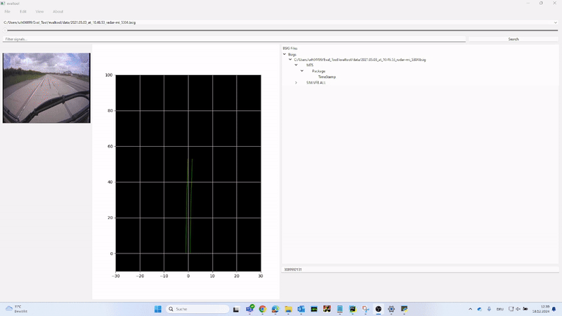
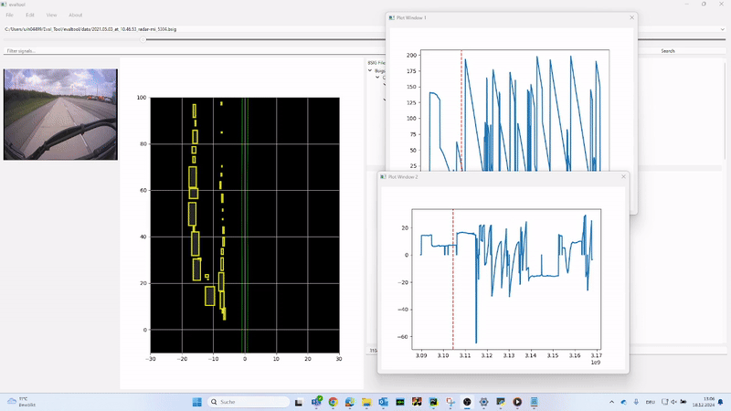
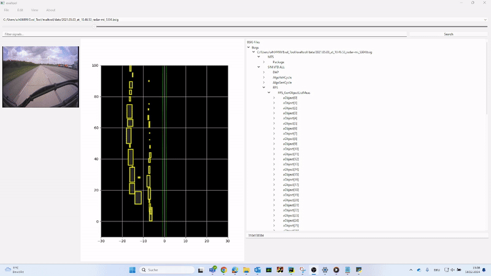
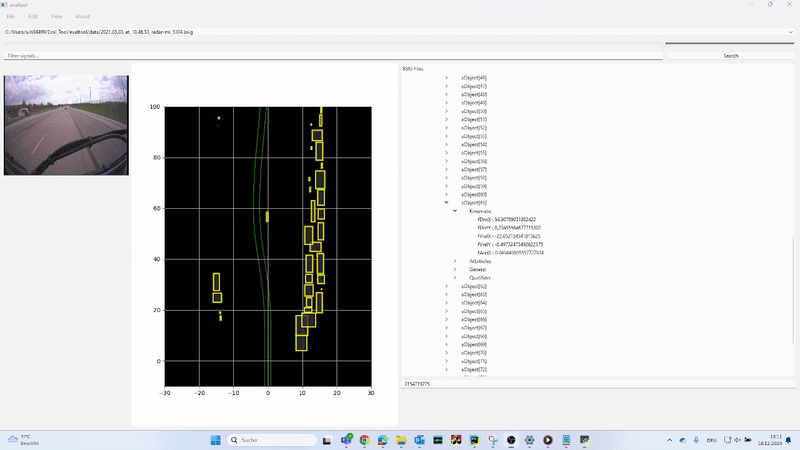
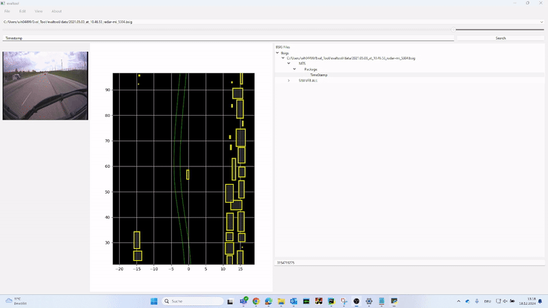
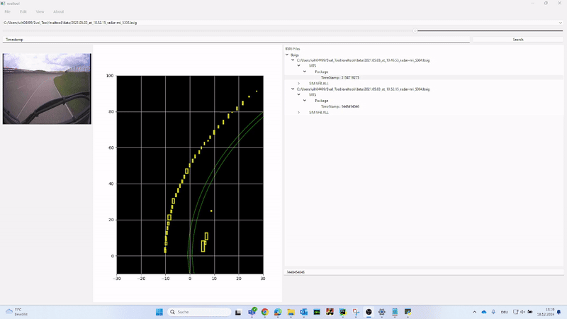

# eval_tool

**Softwaretool zur Auswertung von Fahrzeug- und Sensordaten**

Dieses benutzerfreundliche Tool wurde im Rahmen eines Praktikums bei **Continental** mit **PyQt** entwickelt und unterstützt die strukturierte Datenanalyse.  
Es ermöglicht:  
- Auslesen von Fahr- und Sensordaten  
- Grafische Darstellung der Ergebnisse  
- Gezielte Markierung relevanter Datenbereiche  

Die verarbeiteten Dateien enthalten:  
- Fahrzeugbewegungen  
- Sensordaten  
- Algorithmische Ausgaben  
  - sowohl aus realen Fahrten  
  - als auch aus virtuellen Testumgebungen  
 
# Demo

Hier sind einige kurze Demos des `eval_tool`:

⚠️ **Hinweis:**  
`eval_tool` läuft ausschließlich auf **Continental-Rechnern**, da interne Python-Libraries verwendet werden, die nur für Mitarbeiter zugänglich sind.  

📌 **Wichtiger Hinweis zur Veröffentlichung:**  
Der Code in diesem Repository dient **ausschließlich zur Veranschaulichung im Rahmen von Bewerbungen** und ist **nicht produktiv lauffähig** außerhalb der Continental-Umgebung.  

